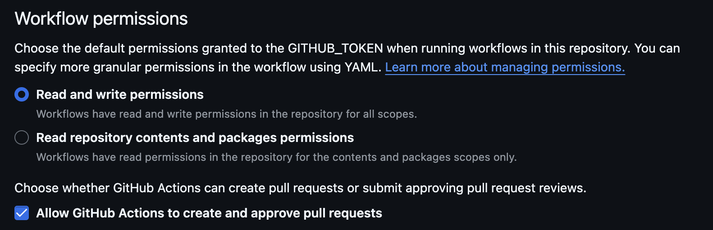

# GitHub Changelog Updater Action

This action automatically updates the `CHANGELOG.md` file in your repository whenever a new pull request is merged. It uses the your Pull Request as data and append it to the changelog. The data that the action gets in yout repository is: 
`title`, `body`, `commits`, `baseBranch`, `prUrl`, `createdAt`, `prNumber`.

## Inputs

| **Name**                  | Type   | Description                                                                                               | Required |
|---------------------------|--------|-----------------------------------------------------------------------------------------------------------|----------|
| **commitEmail**           | string | The email used for committing the updated CHANGELOG.md.                                                   | true     |
| **commitUserName**        | string | The username used for committing the updated CHANGELOG.md.                                                | true     |
| **changelogPath**         | string | Relative path to your changelog file, starting from the root of your project. Default is "./CHANGELOG.md" | false    |
| **githubToken**           | string | GH token that will provide the permissions to read and write in your repository                           | true     |
| **shouldCreateNewTag**    | string | This action should create a new tag when loggin changes?                                                  | false    |


## Usage

### Include this action in your `.github/workflows/my-action.yaml` file. Here is an example:

```yml
name: Updating Changelog
on:
  pull_request:
    branches:
      - master # default branch
    types:
      - closed
jobs:
  updating-change-log:
    runs-on: ubuntu-latest
    steps:
      - name: Checkout code
        uses: actions/checkout@v3
        with:
          ref: master # checkout in default branch

      - name: Update Changelog
        id: action
        uses: AntonioGally/ag-changelogger/@main
        with:
          changelogPath: ./CHANGELOG.md
          commitUserName: AntonioGally
          commitEmail: antonio.gally@gmail.com
          githubToken: ${{ secrets.MY_CHANGELOG_PAT }}
          shouldCreateNewTag: true
```

### Create a PAT to this action

They can be found in [GitHub settings](https://github.com/settings/tokens). We need `repo`, `workflow` and `user` permissions

Here's the [official docs](https://docs.github.com/en/authentication/keeping-your-account-and-data-secure/managing-your-personal-access-tokens)


### Workflow permissions

You can find this configuration under your repo's settings. In you sidebar, navigate to `Actions` > `General`



### Changelog file

Create a initial changelog file that matches with the `relativePath`. By default, this action will try to find CHANGELOG.md in repo's root.


## Observations
 - 🚨 The changelog file must exist in the repository's main branch. 
 - If the pr's title doesn't contains major, minor or patch name, the script will increase the patch number of the version.

## Example


## Contributing
Just send a nice PR that I'll review it with love :D Or just email me as well I'll read

## Under the hood

This project uses ncc to generate a build that bundles all necessary node_modules for the script's execution. The reason behind this approach is to minimize the effort required to run these actions across different repositories. While I could have created a shell script to install dependencies and handle everything manually, I opted for this streamlined solution instead.

The core of the project is a script called changeLogger.js. This script starts by receiving inputs from the workflow and establishing an authenticated connection to the GitHub API. It first retrieves information about the pull request (PR), including all associated commits.

Next, the script determines the next version tag by starting from the latest tag in your repository. If no tags are found, the script will default to v0.1.0. After calculating the next version, it gathers all relevant information into a comprehensive changelog entry.

The script then locates your existing changelog file and appends the newly generated changelog entry. Once the file is updated, it commits the changes using the execSync function from the child_process module. And just like that, your changelog is up to date!

## Best practices
Try to fill the description as much as you can, put images and texts that describe directly what was your change in that PR. In a long run, will help a lot in the changelog file, and will be much nicier to see :D

## Contacts

 - antonio.gally@gmail.com
 - https://www.linkedin.com/in/antonio-gally/
 - https://github.com/AntonioGally